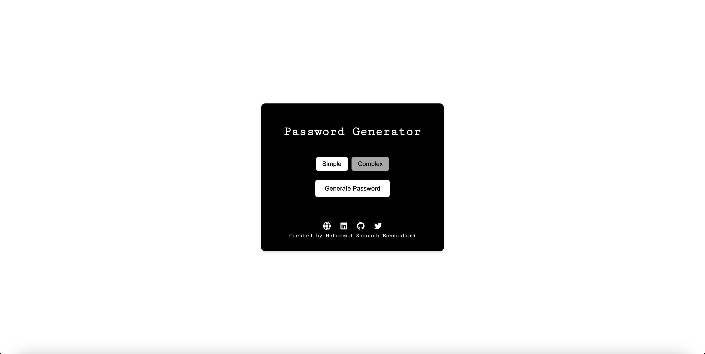

## Password Generator Web Application
**`This repository makes it possible to host the application on GitHub Pages for easy access and use.`**
 

This repository contains the deployment-ready version of the Password Generator Web Application, which you can find the original repository [here](https://github.com/soroushesnaashari/Password-Generator). The app is designed to generate secure and random passwords based on user preferences.
 

### How to use

1. Open the [application](https://soroushesnaashari.github.io/Password-Generator-App/).
2. Adjust the settings (password type) as needed.
3. Click the "Generate Password" button.
4. Copy the generated password using the "Copy Password" button.
